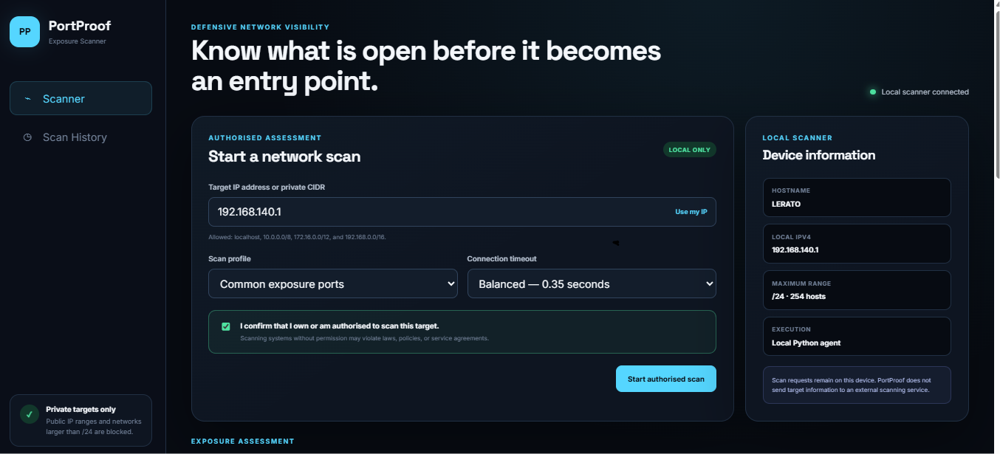
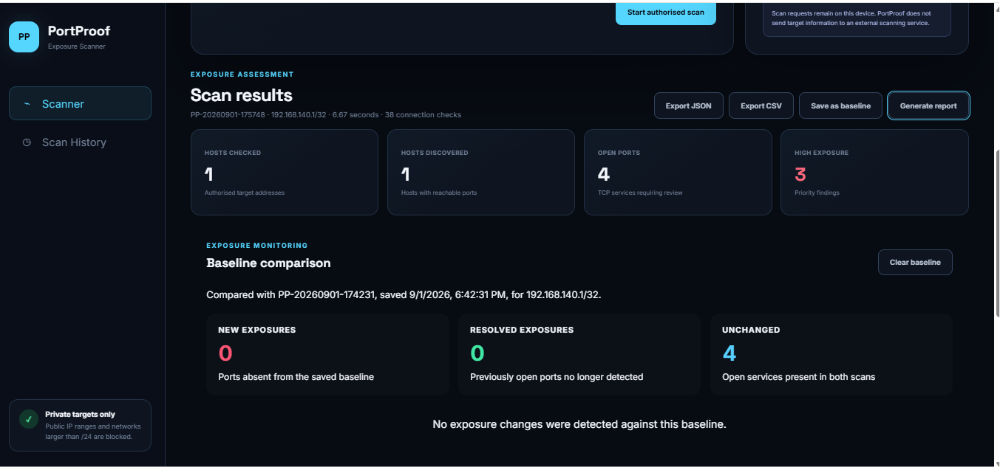
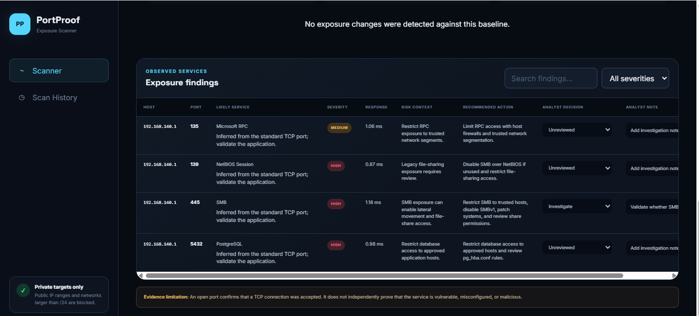

# PortProof

PortProof is a defensive local-network exposure scanner that helps an authorised user identify open TCP ports, review their security context, compare exposure changes and document analyst decisions.

It combines a lightweight Python and Flask scanning engine with a responsive frontend built using HTML, CSS and vanilla JavaScript.

> PortProof is designed only for systems the operator owns or has explicit permission to assess.

## Live demo

**Hosted demonstration:**  
https://portproof-demo.onrender.com

The public deployment runs in a clearly labelled safe demo mode. It uses sample findings and does not perform network scans.

The repository’s local mode performs real authorised TCP connection checks against permitted private networks.



## Why I built it

Open network services can increase an organisation's attack surface, but an open port does not automatically prove that a vulnerability exists.

I built PortProof to practise the complete defensive assessment workflow:

1. Define an authorised private target.
2. Perform controlled TCP connection checks.
3. Identify likely services from standard port assignments.
4. Review exposure context and defensive recommendations.
5. Compare current results against a saved baseline.
6. Record analyst decisions and investigation notes.
7. Export evidence and generate an assessment report.

## Key features

- Scans localhost and RFC1918 private IPv4 networks
- Blocks public IP addresses
- Rejects network ranges larger than `/24`
- Requires explicit authorisation confirmation
- Supports common, extended and custom-port profiles
- Limits custom scans to 128 ports
- Uses concurrent TCP connection checks
- Displays response time and likely service information
- Clearly labels service identification as port-based inference
- Provides evidence-safe risk context
- Provides defensive remediation guidance
- Supports severity filtering and finding search
- Saves scan summaries in browser Local Storage
- Stores analyst decisions and investigation notes
- Saves and compares an exposure baseline
- Detects new, resolved and unchanged exposures
- Exports findings as JSON and CSV
- Generates a printable network-exposure assessment report
- Uses a responsive HTML, CSS and vanilla JavaScript interface
- Supports separate real local and safe hosted-demo modes

## Operating modes

PortProof supports two distinct operating modes.

### Local mode

Local mode performs real TCP connection checks against authorised private IPv4 targets.

It is enabled by default when PortProof is started with:

```powershell
py app.py
```

### Hosted demo mode

Hosted demo mode uses fixed sample findings and does not perform network scans.

This allows recruiters and reviewers to test the complete interface without exposing a public scanning capability.

Hosted demo mode is enabled using:

```text
PORTPROOF_DEMO_MODE=true
```

## Baseline monitoring

PortProof can save a completed scan as a trusted baseline. Later scans of the same target are compared against it.



The comparison identifies:

- **New exposures** — open ports absent from the baseline
- **Resolved exposures** — baseline ports no longer detected
- **Unchanged exposures** — open ports present in both scans

Comparisons are paused when the current scan and saved baseline use different targets. This prevents unrelated devices from producing misleading change results.

## Analyst assessment

Each finding can be assigned one of the following decisions:

- Unreviewed
- Investigate
- Accepted risk
- False positive
- Remediated

Analyst decisions and notes are stored locally in the browser and remain available after refreshing the application.



## Risk and remediation guidance

PortProof separates risk context from recommended defensive action.

For each recognised port, it provides:

- A likely service name
- A severity classification
- An explanation of the exposure
- A recommended defensive action
- A service-confidence limitation

Service names are inferred from standard TCP port assignments and are not presented as confirmed application identification.

## Evidence limitations

PortProof performs TCP connection checks. An open port confirms that a connection was accepted, but it does not independently prove:

- The exact listening application
- The application version
- The presence of a vulnerability
- A security misconfiguration
- Successful exploitation
- Malicious activity

Likely services are inferred from standard port assignments and require further validation.

Severity represents exposure context and prioritisation, not confirmed compromise.

## Safety controls

PortProof contains deliberate technical restrictions:

- Only loopback and RFC1918 private IPv4 targets are allowed
- Public IP ranges are rejected
- IPv6 targets are not supported
- Networks larger than `/24` are rejected
- Extended scans are restricted to a single host
- Custom scans are limited to 128 ports
- Connection timeouts are bounded
- Local mode binds to `127.0.0.1`
- The interface requires authorisation confirmation
- Target information is not sent to an external scanning service
- Hosted mode returns fixed sample data instead of executing scans

These safeguards support defensive lab use but do not replace the operator's legal and ethical responsibility.

## Technology stack

### Frontend

- HTML5
- CSS3
- Vanilla JavaScript
- Fetch API
- Local Storage
- Responsive layouts
- Dynamic DOM rendering
- JSON and CSV file generation
- Printable HTML reports

### Backend

- Python 3
- Flask
- Gunicorn
- Python `socket` module
- `ipaddress` validation
- `ThreadPoolExecutor`
- Dataclasses

### Deployment

- Render Web Service
- Environment-controlled demo mode
- GitHub source control
- Gunicorn production server

## Project structure

```text
PortProof/
├── app.py
├── scanner.py
├── requirements.txt
├── README.md
├── .gitignore
├── static/
│   ├── styles.css
│   └── script.js
├── templates/
│   └── index.html
└── screenshots/
    ├── analyst_assessment.png
    ├── baseline_comparison.png
    └── scanner_dashboard.png
```

## Running PortProof locally

### 1. Clone the repository

```bash
git clone https://github.com/sharmainelerato-glitch/PortProof.git
cd PortProof
```

### 2. Create a virtual environment

Windows PowerShell:

```powershell
py -m venv .venv
.venv\Scripts\Activate.ps1
```

macOS or Linux:

```bash
python3 -m venv .venv
source .venv/bin/activate
```

### 3. Install the dependencies

```bash
pip install -r requirements.txt
```

### 4. Start PortProof

Windows:

```powershell
py app.py
```

macOS or Linux:

```bash
python3 app.py
```

### 5. Open the application

Visit:

```text
http://127.0.0.1:5050
```

## Testing hosted demo mode locally

Windows PowerShell:

```powershell
$env:PORTPROOF_DEMO_MODE="true"
py app.py
```

To return to real local mode:

```powershell
Remove-Item Env:PORTPROOF_DEMO_MODE
py app.py
```

macOS or Linux:

```bash
PORTPROOF_DEMO_MODE=true python3 app.py
```

## Example authorised assessment

A controlled assessment of a private local target identified open services associated with Microsoft RPC, NetBIOS, SMB and PostgreSQL.

PortProof treated the service names as port-based inferences, prioritised the exposure for review and provided defensive recommendations.

It did not claim that the device was vulnerable or compromised.

## Reporting

PortProof can generate:

- Raw JSON evidence
- CSV findings
- A printable exposure-assessment report

The report includes:

- Executive summary
- Assessment scope
- Authorisation statement
- Exposure metrics
- Baseline comparison
- Findings
- Risk context
- Recommended actions
- Analyst decisions
- Analyst notes
- Evidence limitations

## Skills demonstrated

### Cybersecurity

- Network exposure assessment
- TCP port-scanning fundamentals
- Attack-surface awareness
- Defensive risk prioritisation
- Evidence-based security reporting
- Analyst triage
- Baseline monitoring
- Secure scope validation
- Ethical testing controls

### Frontend development

- Semantic HTML
- Responsive CSS
- CSS Grid and Flexbox
- Media queries
- Vanilla JavaScript
- Dynamic DOM rendering
- Client-side state management
- Local Storage persistence
- Search and filtering
- Accessible form controls
- Fetch API integration
- JSON and CSV exports
- Printable report generation

### Backend development

- Flask API development
- Python socket programming
- IPv4 and CIDR validation
- Concurrent connection checks
- Environment-based configuration
- Error handling
- Security headers
- Production deployment with Gunicorn

## Deployment

The public portfolio demonstration is deployed on Render:

https://portproof-demo.onrender.com

The hosted service runs only in safe demo mode. It returns fixed sample results and cannot be used to scan public, private or third-party networks.

Real authorised assessments remain available through local mode.

Free Render services may take a short time to wake after a period of inactivity.

## Responsible use

Only scan systems and networks that you own or have explicit permission to assess.

PortProof must not be used to target public systems or third-party networks without authorisation.